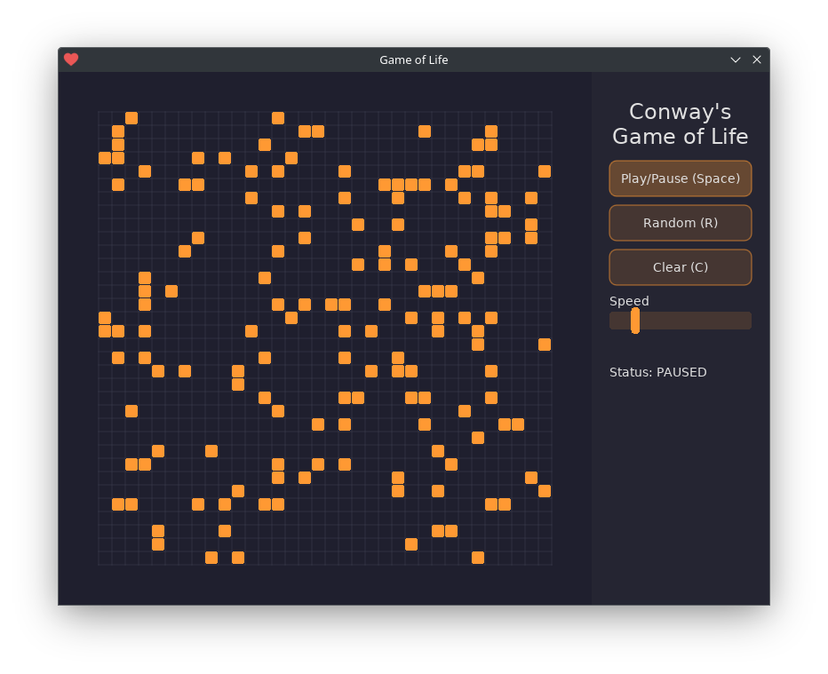

# Conway's Game of Life simulator



## How to run

You need to have [Lua](https://www.lua.org/download.html) installed.

Along with [Love2D](https://love2d.org/), which is the only dependency, you can run the simulation by running the following command:

```bash
love src
```

(love runs a directory as a package so don't do `love .`)

## License

Apache 2.0
